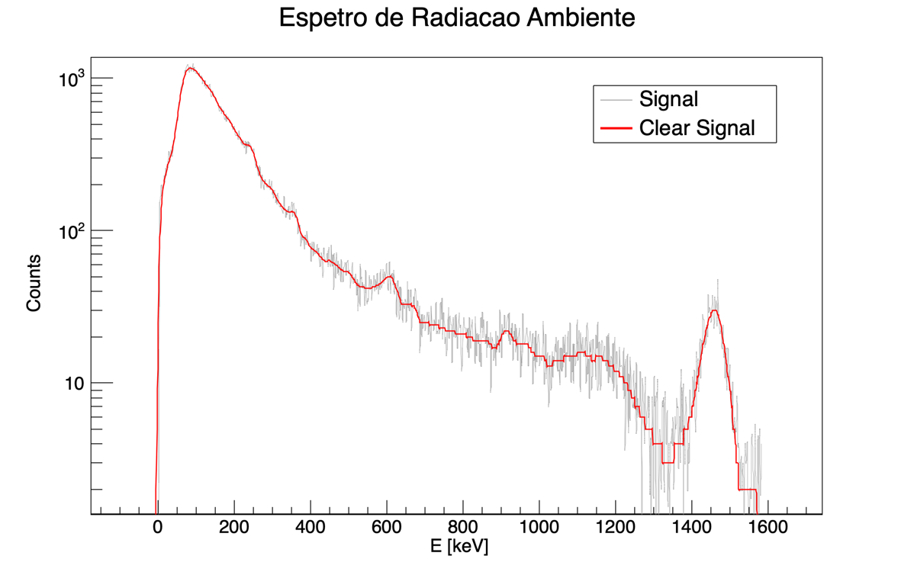

# LogBook Relativo à Realização do Estudo do Detetor Geiger-Müller:

A experiência que em seguida se descreve foi realizada no dia 31 de maio de 2023, com início às 11:30 da manhã e fim às 15:00. O nosso grupo é o 1D e é formado pelo seguintes membros: Estêvão Gomes (ist1102650), Pedro Curvo (ist1102716), Sofia Tété (ist1102633) e Salvador Torpes (ist1102474). LogBook realizado por Sofia Tété.

1. **Estudo do detector:**
   - Ligamos o detetor e começamos por analisar o detetor e perceber que a voltagem a que este se encontrava sujeito se controlava a partir do programa GMX (computador) ao qual o detetor já se encontrava ligado;
   - Em seguida, colocamos a fonte de tálio marcada com L03 (Tl - 204) virada para cima na prateleira 3 do detetor;
   - No programa de aquisição GMX, selecionamos um tempo de 2 segundos por cada intervalo de voltagem e iniciamos as medições nos 25 Volts. Verfificamos que o detetor apenas começa a registar contagens a partir dos 725 V;
   - Agora que realizamos esta aquisição mais bruta de dados, percebemos que o plateau tem inicio perto dos 725 V. Podemos agora realizar uma aquisição mais cuidadosa para o detetar mais precisamente;
   - Iniciamos as medições. Para tal, selecionamos um time-step de 30 segundos para cada voltagem e uma voltagem inicial de 600 V. O objetivo desta etapa é, encontrar as voltagens onde o plateau deste detetor de Geiger Müller começa e termina para que possamos definir a voltagem que iremos utilizar para as seguintes etapas deste trabalho laboratorial;
   - Repetimos o processo com o mesmo time-step e começando na mesmo nos 600 V de modo a obter uma maior precisão nos dados. Obtivemos os seguintes dados:

   | Voltagem (V)      | Contagem 1 | Contagem 2 | 
   |-------------------|------------|------------|
   | 700               | 0          | 0          | 
   | 725               | 0          | 0          |
   | 750               | 549 ± 23   | 1 ± 1      | 
   | 775               | 553 ± 24   | 575 ± 24   | 
   | 800               | 651 ± 26   | 565 ± 24   | 
   | 825               | 651 ± 26   | 626 ± 25   | 
   | 850               | 617 ± 25   | 682 ± 26   | 
   | 875               | 675 ± 26   | 667 ± 26   | 
   | 900               | 687 ± 26   | 666 ± 26   | 
   | 925               | 653 ± 26   | 675 ± 26   | 
   | 950               | 663 ± 26   | 690 ± 26   | 
   | 975               | 673 ± 26   | 685 ± 26   | 
   | 1000              | 736 ± 27   | 707 ± 27   | 
   | 1025              | 767 ± 28   | 738 ± 27   | 
   | 1050              | 796 ± 28   | 764 ± 28   | 
   | 1075              | 701 ± 26   | 746 ± 27   | 
   | 1100              | 754 ± 27   | 782 ± 28   | 
   | 1125              | 737 ± 27   | 785 ± 28   | 
   | 1150              | 750 ± 27   | 740 ± 27   | 
   | 1175              | 757 ± 28   | 810 ± 28   | 
   | 1200              | 775 ± 28   | 770 ± 28   | 
   | Tempo de contagem | 60 s       |            |            

   - Após uma primeira análise destes dados, concluimos que o plateau deste detetor Geiger-Müller se situava entre 800 V e 1200 V. Selecionamos o início do plateau na voltagem para a qual observamos que os dados começavam a comportar-se linearmente e o fim corresponde apenas à última voltagem aplicada pelo sistema. Em seguida, selecionamos uma tensão de 950 V para utilizar no resto deste trabalho, que corresponde a certa de 3/8 do plateau.
   - Com a tensão que escolhemos no ponto anterior, realizamos duas aquisições de 5 segundos com a fonte de tálio virada para cima e duas aquisições com a fonte virada para baixo, totalizando 10 segundos de aquisição para cada um das faces. Para a fonte virada para cima, registamos e contagens e para a fonte virada para baixo registamos e contagens. Obtivemos os seguintes dados:

   |                         | 1º Medição | 2º Medição | Contagens Totais | Taxa de Contagens |
   |-------------------------|------------|------------|------------------|-------------------|
   | Fonte virada para cima  | 117±11     | 118±11     | 235±22           | 23,5±2,2          |
   | Fonte virada para baixo | 2±1        | 1±1        | 3±2              | 0,3±0,2           |
   | Tempo de contagem       | 10 s       |            |                  |                   |

   - De seguida, passámos para a medição do tempo morto do detetor. Para tal utilizámos combinações de três fontes em meia-lua, das quais a 1 e 2 contêm Tálio-204 e a 0 nenhum isótopo radioativo.
   - Fizémos duas medições de 60 segundos para cada combinação de fontes, de modo a ter uma medição total de 120 segundos.
   - Primeiro usámos uma combinação da fonte 0 e 1, tendo obtido 4680 contagens na 1º medição e 4491 contagens na 2º medição.
   - De seguida medimos as contagens para a combinação de fontes 0 e 2, obtendo-se 4561 contagens para a 1º medição e 4618 contagens para a 2º medição.
   - Por fim, usámos a combinação das fontes 1 e 2, tendo-se obtido 8278 contagens para a 1º medição e 8230 contagens para a 2º medição.
   - Para a medição da radiação ambiente, fizémos duas medições de 30 segundos sem utilizar nenhuma fonte, tendo-se obtido 19 contagens em ambas as medições.
1. **Estudo da eficiência do detector:**
   - Com objetivo de estudar  eficiência dos betas colocamos uma fonte de tálio que tem betas muito energéticos. Queresmos concluir se as placas de aluminio bloqueiam os betas do tálio. Caso os bloqueiam, também bloquearão os do césio dado que estes são menos energéticos. 
   - Para isso, colocamos na prateleira 3 a fonte de tálio e na prateleira 2 uma placa de aluminio totalmente tapada. Realizámos 30 segundos de aquisição de dados duas vezes na tensão de 950V e obtivemos, repetivamente, 16 e 17 contagens. Verificamos que as contagens obtidas se assemelham às contagens obtidas para a radiação ambiente, pelo que concluimos que a placa de aluminio bloqueia os betas do tálio.
   - 
2. **Estudo da intensidade da radiação com a distância:**
   - Começamios por colocar a fonte de césio virada para cima no suporte
   - Para cada uma daa prateleiras 1 a 5, realizamos 30 segundos de aquisição de dados duas vezes para cada prateleira na tensão de 950V. Para cada medição, colocamos na prateleira imediatamente acima à prateleira onde de encontrava o césio uma placa de alumínio totalmente tapada com o objetivo de bloquear a radiação beta;
   - Em seguida, repetimos o procedimento anterior, mas desta vez não colocamos a placa de alumínio;
3. **Estudo da atenuação de partículas na matéria:**
   - ...
4. 

// { width=150px }
// usem ../pngs/ para as imagens que estão na pasta pngs os .. voltam atras e entram na pasta 
// o { width=150px } é para definir o tamanho da imagem nao aparece na preview mas aparece no pdf
