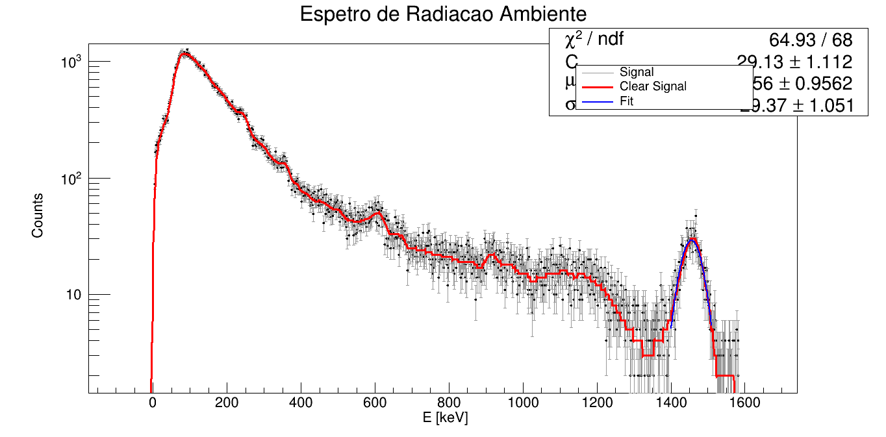

# LogBook Relativo à Realização do Estudo do Detetor Geiger-Müller:

A experiência que em seguida se descreve foi realizada no dia 31 de maio de 2023, com início às 11:30 da manhã e fim às 15:00. O nosso grupo é o 1D e é formado pelo seguintes membros: Estêvão Gomes (ist1102650), Pedro Curvo (ist1102716), Sofia Tété (ist1102633) e Salvador Torpes (ist1102474). LogBook realizado por Salvador Torpes.

1. **Estudo do detector:**
   - Começamos por analisar o detetor e perceber que a voltagem a que este se encontrava sujeito se controlava a partir do programa DMX (computador) ao qual o detetor já se encontrava ligado;
   - Em seguida, colocamos a fonte de tálio do seu suporte e
2. **Estudo da eficiência do detector:**
   - ...
3. **Estudo da intensidade da radiação com a distância:**
   - ...
4. **Estudo da atenuação de partículas na matéria:**
   - ...
5. 

{ width=150px }
// usem ../pngs/ para as imagens que estão na pasta pngs os .. voltam atras e entram na pasta 
// o { width=150px } é para definir o tamanho da imagem nao aparece na preview mas aparece no pdf
