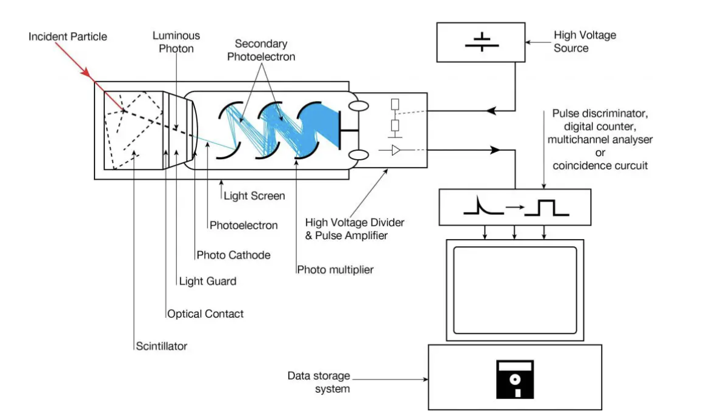

# Introdução ao Detetor de Cintilação

## Questões

### Esboce o esquema do detetor, identificando as componentes principais.

### Procedimento experimental
- Colocamos o césio perto do cristal do cintilador
- Ligamos a fonte de alta tensão ao detetor
- Ligamos o detetor ao amplificador e o amplificador ao osciloscópio 
- Em seguida, ligamos um cabo T à entrada do osciloscópio de modo a poder receber o sinal proveniente do amplificador e simultaneamente envia-lo para o computador. de modo a obter o espetro de emissão do césio todo nos 1024 canais do sistema de aquisição, colocamos o amplificar num fator de 10;
- Queremos establecer uma relação unívoca entre a energia dos eletrões no detetor e o número de canais do sistema de aquisição:

### Calibração do sistema 
Para calibrar o sistema vamos recorrer ao **_pulser_** para fazer uma regressão linear entre o número de canais e a energia do pulso incidente - assim podemos estimar qual é a energia correspondente a qualquer ponto - o valor de calibração é o pico dos raios $\gamma$ que está tabelado (usamos o tabelado para calibrar)
### Calibração com o pulser
- Medimos o numero de channels correspondentes a cinco pulses diferentes: fizemos o ajuste linear recoorrendo ao python e sabendo que o ponto de calibração é o do centróide visto anteriormente =(538,67 ch;661,657 keV);
- o numero de eletrões resultante de cada choque de fotões (com a mesma energia) no cristal segue uma distribuição de poisson - o conjunto de todos os eletrões que chocam com o cristal segue uma distribuição normal daí que facamos o ajuste de uma gaussiana aos picos de energia observados no sistema de aquisição (PC) - a incerteza da média (o erro) é a média(sigma) a dividir por raiuz de N (n de medições)
- o espetro de energia tem uma gaussiana na radiação $\gamma$;
### Identifique os parâmetros de operação do detetor.
> Os parâmetros são a alta tensão e o pré-amplificador (não vamos mexer neste último)

### Analise os espectros identificando e caracterizando as diferentes estruturas que possam estar presentes.
> Conseguimos ver um total de 3 picos. Inicialmente existe o pico mais alto de todos (o qual tem menos energia dado que está no início do eixo dos x). Este pico corresponde aos raios X emitidos pela fonte de césio. De seguida, vê-se o patamar de compton, isto é, uma parte aproximadamente reta onde também se verifica a existência de emissão de radiação $\gamma$. No meio do patamar existe um pequeno pico, associado à emissão de radiação gama. Após o patamar de compton temos o maior pico, o qual corresponde também à emissão de radiação gama (neste caso a mais energética).

### Qual a estatística que deve ser utilizada por forma a ter uma incerteza de 10% no número de contagens do pico de absorção total do Césio?
> Estamos perante uma distribuição de Poisson, pelo que a incerteza é dada por sqrt(N), onde N é o número de contagens. Queremos que a incerteza seja 10% do número de contagens, ou seja, sqrt(N)=0.1N. Logo, concluimos que N=10.
     
### Qual a estatística que deve ser utilizada por forma a ter uma incerteza de 10% na posição do centroide do pico de absorção total do Césio? 
> Utilizando o mesmo método que anteriormente, queremos $\sigma\sqrt(N)=0.1$. Logo $N=100{\sigma}^2$

### Radiação Ambiente
### O sistema regista eventos na ausência de uma fonte radioativa? 
> Sim, a radiação ambiente maioritariamente devida à existência de potássio-40 em muitos dos materiais do dia-a-dia.

### Compare a taxa de eventos com as outras aquisições.  
> Existem menos eventos do que nas outras aquisições feitas com a fonte radioativa.

### Consegue identificar alguma estrutura? Quanto tempo necessitaria para ter uma incerteza de 10% na taxa de eventos no pico de absorção total do 40K ?
> Temos que fazer extamente as mesmas contas que realizámos anteriormente, obtendo de novo N=100 e $N=100{\sigma}^2$.

## Funcionamento do detetor de cintilação
- aceleramos os eletrões com campos elétricos
- a fonte emite fotões mais ou menos energéticos - no cristal do detetor ocorre efeito fotoelétrico devido à metal coat na qual o metal está envolto e há emissão de eletrões (foteletrões) que são tanto mais energéticos consoante os fotões que lhes deram origem
- em seguida os eletrões entram no fotomultiplicador onde atravessam diversas placas sujeitas a uma diferença de potencial
- entre as placas existe um campo eleétrico que acelera os eletrões de tal modo que quando eles embatem nas placas seguintes têm energia suficiente para retirar mais eletrões
- no fim atinge o detetor e são detetatos eletrões em diferentes quantidades consoante as suas energias;

O que é que o césio dá?
>cancro